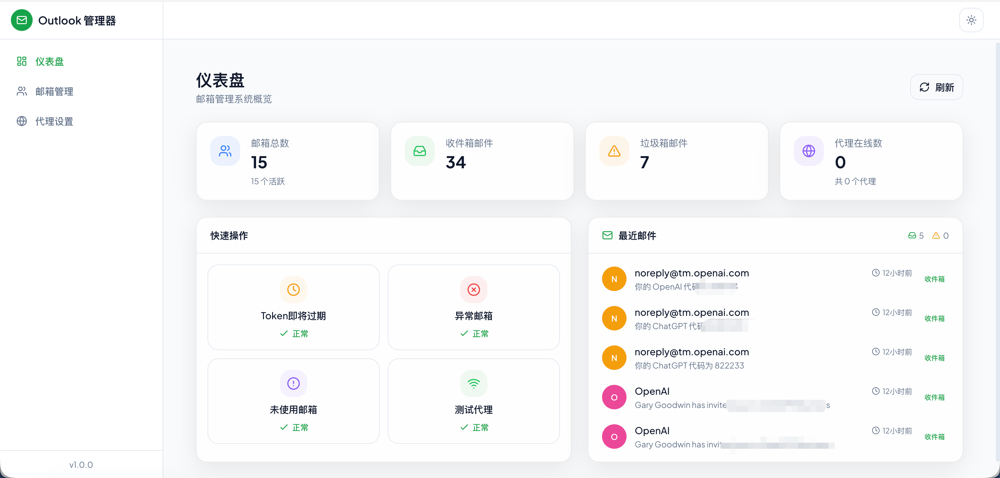
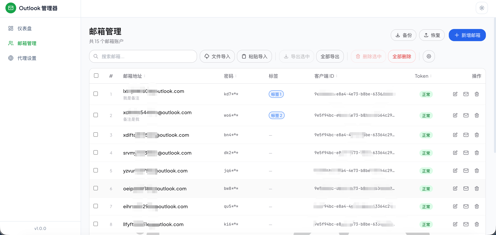
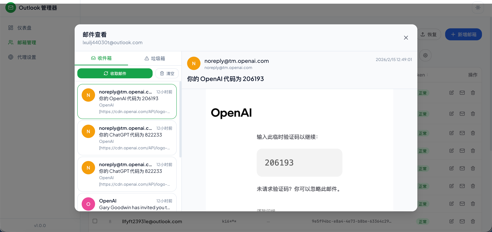
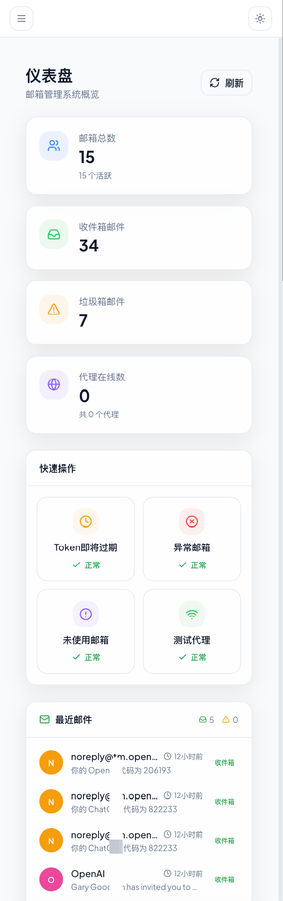

# Outlook 邮箱管理器

一个用于批量管理 Microsoft Outlook 邮箱账户的全栈 Web 应用。支持 OAuth2 双协议（Graph API + IMAP）收取邮件，内置代理管理，提供现代化的 Glassmorphism 风格界面。

## 界面预览

| 仪表盘 | 邮箱管理 |
|:---:|:---:|
|  |  |

| 邮件查看 | 移动端 |
|:---:|:---:|
|  |  |

## 技术栈

| 层级 | 技术 |
|------|------|
| 后端 | Koa 3 + TypeScript + SQLite (better-sqlite3) |
| 前端 | React 19 + Tailwind CSS 3 + Zustand 5 + Framer Motion 11 |
| UI 组件 | Radix UI 原语 + 自定义 Glassmorphism 组件 |
| 邮件协议 | Microsoft Graph API / IMAP (XOAUTH2) |
| 代理 | SOCKS5 (socks-proxy-agent) / HTTP (undici ProxyAgent) |

## 功能概览

- **仪表盘** — 账户统计、最近邮件、快捷操作
- **账户管理** — 批量导入/导出、搜索、分页、多选操作、列排序与显隐
- **标签系统** — 创建/编辑/删除标签，为账户分配标签，右键快速切换
- **邮件查看** — 三栏布局（账户列表 → 邮件列表 → 邮件正文），支持收件箱/垃圾邮件切换
- **代理设置** — SOCKS5/HTTP 代理管理、连通性测试、默认代理设置
- **双协议收信** — Graph API 优先，IMAP 自动降级，本地缓存兜底
- **访问密码** — 可选的访问密码保护，SHA256 Token 认证
- **数据备份** — 一键备份/恢复 SQLite 数据库
- **导入去重** — 两步导入流程（预览 → 确认），支持跳过/覆盖重复项
- **深色/浅色主题** — 跟随系统或手动切换
- **响应式布局** — 移动端适配，侧边栏抽屉模式

## 项目结构

```
outlook-mail-manager/
├── server/                  # 后端服务
│   └── src/
│       ├── config/          # 环境配置
│       ├── controllers/     # 请求处理器
│       ├── database/        # SQLite 连接 & 迁移
│       ├── middlewares/      # 日志 & 错误处理
│       ├── models/          # 数据访问层
│       ├── routes/          # API 路由
│       ├── services/        # 业务逻辑（OAuth、Graph、IMAP、代理）
│       ├── types/           # TypeScript 类型定义
│       └── utils/           # 工具函数
├── web/                     # 前端应用
│   └── src/
│       ├── components/      # UI 组件（按模块分组）
│       ├── lib/             # API 客户端 & 工具函数
│       ├── pages/           # 页面组件
│       ├── stores/          # Zustand 状态管理
│       └── types/           # 前端类型定义
├── .env.example             # 环境变量模板
└── package.json             # 根 monorepo 配置
```

## 快速开始

### 环境要求

- Node.js >= 18
- npm >= 9

### 安装

```bash
# 克隆项目后，一键安装所有依赖
npm run install:all
```

### 配置

复制环境变量模板并按需修改：

```bash
cp .env.example .env
```

| 变量 | 默认值 | 说明 |
|------|--------|------|
| `PORT` | `3000` | 服务端口 |
| `LOG_LEVEL` | `info` | 日志级别 |
| `DB_PATH` | `./data/outlook.db` | SQLite 数据库路径（相对于 server/） |
| `ACCESS_PASSWORD` | _(空)_ | 访问密码，留空则不启用认证 |

### 开发模式

```bash
# 同时启动前后端（热重载）
npm run dev
```

- 前端：http://localhost:5173（Vite dev server，自动代理 `/api` 到后端）
- 后端：http://localhost:3000

### 生产构建

```bash
# 构建前端
npm run build

# 启动后端（同时托管前端静态文件）
npm start
```

访问 http://localhost:3000 即可使用。

## Cloudflare Workers 部署

本项目可以部署为一个 Cloudflare Worker：

- 前端静态资源由 Cloudflare Assets 托管
- `/api/*` 由 `server/src/cloudflare/worker.ts` 处理
- 数据库存储切换为 D1
- 当前 Cloudflare 运行时仅保留 Graph API 路径
- `IMAP`、代理链路、文件备份在 Cloudflare 运行时下禁用

下面这套流程按“从克隆仓库到线上可访问”编排。

### 0. 部署前提

你需要先准备好：

- 一个 Cloudflare 账号
- Node.js `>= 18`
- npm `>= 9`
- 可以正常使用 `npx`

推荐先安装依赖再登录 Wrangler：

```bash
git clone <你的仓库地址>
cd outlook-mail-manage
npm run install:all
npx wrangler login
```

如果你已经在服务器或 CI 中使用 API Token，也可以不执行 `wrangler login`，改为让 Wrangler 读取 Cloudflare 认证环境。

### 1. 克隆后先确认项目里的 Cloudflare 入口

Cloudflare 部署相关文件如下：

- `wrangler.jsonc`
- `.dev.vars.example`
- `server/src/cloudflare/worker.ts`
- `server/d1/migrations/0001_initial.sql`

本项目的 Worker 名称、D1 绑定名、Assets 绑定名都已经在 `wrangler.jsonc` 中定义好，部署时最关键的是把 D1 数据库 ID 和变量值填正确。

### 2. 在 Cloudflare 创建 D1 数据库

先创建生产数据库：

```bash
npx wrangler d1 create outlook-mail-manage
```

执行后会返回一段类似下面的信息：

```txt
database_name = "outlook-mail-manage"
database_id = "xxxxxxxx-xxxx-xxxx-xxxx-xxxxxxxxxxxx"
```

把这个 `database_id` 填入根目录 `wrangler.jsonc`：

```jsonc
{
  "d1_databases": [
    {
      "binding": "DB",
      "database_name": "outlook-mail-manage",
      "database_id": "这里替换成真实 D1 database_id",
      "migrations_dir": "server/d1/migrations"
    }
  ]
}
```

这里有 3 个名字不要混：

- `binding`: 代码里读取数据库时使用的绑定名，当前必须是 `DB`
- `database_name`: 你在 Cloudflare 里创建的 D1 数据库名字，默认用 `outlook-mail-manage`
- `database_id`: Cloudflare 分配的真实数据库 ID，必须替换占位值

### 3. 配置 `wrangler.jsonc`

当前仓库的 `wrangler.jsonc` 关键字段含义如下：

| 字段 | 当前值 | 作用 | 是否必须修改 |
|------|--------|------|--------------|
| `name` | `outlook-mail-manage` | Worker 名称 | 可选 |
| `main` | `server/src/cloudflare/worker.ts` | Worker 入口 | 否 |
| `assets.directory` | `./web/dist` | 前端构建产物目录 | 否 |
| `assets.binding` | `ASSETS` | Worker 内部访问静态资源的绑定名 | 否 |
| `assets.run_worker_first` | `true` | 先进入 Worker，再决定是否转发静态资源 | 否 |
| `assets.not_found_handling` | `single-page-application` | 让前端路由支持 SPA fallback | 否 |
| `d1_databases[].binding` | `DB` | D1 绑定名 | 否 |
| `d1_databases[].database_name` | `outlook-mail-manage` | D1 数据库名称 | 可选 |
| `d1_databases[].database_id` | 占位值 | 生产 D1 数据库 ID | 是 |
| `vars.DB_PROVIDER` | `d1` | 强制运行时走 D1 | 否 |
| `vars.D1_DATABASE_BINDING` | `DB` | 运行时读取哪个 D1 绑定 | 否 |
| `vars.LOG_LEVEL` | `info` | 日志级别 | 可选 |
| `vars.ACCESS_PASSWORD` | 空字符串 | 访问密码 | 建议改为 Secret |

如果你要改 Worker 名称，例如改成 `my-outlook-mail-manage`，通常只需要同步修改：

- `wrangler.jsonc` 的 `name`
- 如果你自己建了不同名字的 D1，也同步修改 `database_name`

`binding` 名不要随意改。当前代码默认读的是：

- D1 绑定名：`DB`
- Assets 绑定名：`ASSETS`

### 4. 设置 Cloudflare 变量和密钥

本项目部署到 Cloudflare 时，真正需要关心的变量名如下：

| 类型 | 名称 | 示例值 | 是否敏感 | 说明 |
|------|------|--------|----------|------|
| D1 Binding | `DB` | D1 数据库绑定 | 否 | 在 `wrangler.jsonc` 的 `d1_databases[].binding` 中声明 |
| Worker Variable | `DB_PROVIDER` | `d1` | 否 | 指定数据库提供者 |
| Worker Variable | `D1_DATABASE_BINDING` | `DB` | 否 | 运行时读取的 D1 绑定名 |
| Worker Variable | `LOG_LEVEL` | `info` | 否 | 日志等级 |
| Worker Secret | `ACCESS_PASSWORD` | 你自定义的密码 | 是 | 后台访问密码，可留空 |
| Assets Binding | `ASSETS` | 静态资源绑定 | 否 | 由 `assets.binding` 自动提供，不需要手动创建 |

推荐做法：

- 非敏感值继续放在 `wrangler.jsonc` 的 `vars` 中
- `ACCESS_PASSWORD` 不要明文写进 `wrangler.jsonc`，改用 Cloudflare Secret

设置生产环境访问密码：

```bash
npx wrangler secret put ACCESS_PASSWORD
```

如果你不想加访问密码，可以不设置这个 Secret，同时让 `wrangler.jsonc` / `.dev.vars` 中的 `ACCESS_PASSWORD` 保持空值。

### 5. 本地开发变量怎么配

复制模板：

```bash
cp .dev.vars.example .dev.vars
```

`.dev.vars` 建议内容：

```env
ACCESS_PASSWORD=
LOG_LEVEL=info
DB_PROVIDER=d1
D1_DATABASE_BINDING=DB
```

说明：

- 本地 `wrangler dev` 会读取 `.dev.vars`
- 如果你本地也要测试访问密码，就给 `ACCESS_PASSWORD` 填值
- `DB_PROVIDER` 固定为 `d1`
- `D1_DATABASE_BINDING` 必须和 `wrangler.jsonc` 里的 `binding` 一致，即 `DB`

### 6. 是否需要设置 GitHub 仓库变量

当前仓库没有内置 GitHub Actions 的 Cloudflare 自动部署工作流，因此：

- 不需要设置 GitHub Repository Variables
- 不需要设置 GitHub Repository Secrets

也就是说，**这个仓库当前的标准部署方式是本地 CLI 部署**，不是 push 后自动发版。

如果你未来要自己补 CI，再考虑这些 GitHub Secrets：

- `CLOUDFLARE_API_TOKEN`
- `CLOUDFLARE_ACCOUNT_ID`

但这不是当前仓库运行所必需的。

### 7. 首次初始化数据库

本项目的 D1 初始化 SQL 位于：

```txt
server/d1/migrations/0001_initial.sql
```

首次本地开发时，先初始化本地 D1：

```bash
npx wrangler d1 migrations apply outlook-mail-manage --local
```

首次部署到 Cloudflare 远端生产库时，再执行一次远端迁移：

```bash
npx wrangler d1 migrations apply outlook-mail-manage
```

如果你把 `database_name` 改成了别的名字，这里命令里的 `outlook-mail-manage` 也要同步改掉。

### 8. 部署前本地验证

先跑构建：

```bash
npm run build:cloudflare
```

然后本地启动 Worker：

```bash
npm run dev:cloudflare
```

你至少要检查下面几项：

- 首页能正常打开
- 页面刷新不会出现 404
- `/api/runtime/capabilities` 能返回 `runtime: cloudflare`
- 账户列表接口可访问
- 仪表盘统计接口可访问
- 代理页面会显示 Cloudflare 受限提示

### 9. 正式部署到 Cloudflare

确认构建正常、D1 远端迁移已执行后，运行：

```bash
npm run deploy:cloudflare
```

这个命令会执行：

1. `npm run build:server`
2. `npm run build:web`
3. `npx wrangler deploy`

部署完成后，Wrangler 会输出一个 Worker 地址，通常形如：

```txt
https://outlook-mail-manage.<subdomain>.workers.dev
```

这就是默认可访问地址。

### 10. 上线后的首次操作建议

首次打开后，建议按下面顺序检查：

1. 访问首页，确认前端资源正常加载
2. 如果设置了 `ACCESS_PASSWORD`，确认登录弹窗正常出现
3. 进入账户页面，导入一批测试账户
4. 打开仪表盘，确认统计接口正常
5. 打开代理页面，确认 Cloudflare 受限提示已显示
6. 测试一条 Graph API 收信流程

### 11. Cloudflare 模式下的已知限制

Cloudflare 运行时下当前不是完整等价于 Node 本地版，限制如下：

- 不支持 IMAP
- 不支持代理测试与默认代理切换
- 不支持依赖本地文件的数据库备份/恢复
- 邮件收取路径应以 Graph API 为主

如果你需要 IMAP、代理链路或本地 SQLite 文件备份，应该继续使用 Node 本地/服务器部署版本。

## API 端点

### 账户 `/api/accounts`

| 方法 | 路径 | 说明 |
|------|------|------|
| GET | `/` | 获取账户列表（支持分页、搜索） |
| GET | `/:id` | 获取单个账户 |
| POST | `/` | 创建账户 |
| PUT | `/:id` | 更新账户 |
| DELETE | `/:id` | 删除账户 |
| POST | `/batch-delete` | 批量删除 |
| POST | `/import` | 批量导入 |
| GET | `/export/all` | 导出全部 |

### 邮件 `/api/mails`

| 方法 | 路径 | 说明 |
|------|------|------|
| POST | `/fetch` | 拉取邮件（Graph API → IMAP 降级） |
| POST | `/fetch-new` | 仅拉取新邮件 |
| GET | `/cached/:accountId` | 获取缓存邮件 |
| DELETE | `/clear/:accountId` | 清除缓存 |

### 代理 `/api/proxies`

| 方法 | 路径 | 说明 |
|------|------|------|
| GET | `/` | 获取代理列表 |
| POST | `/` | 创建代理 |
| PUT | `/:id` | 更新代理 |
| DELETE | `/:id` | 删除代理 |
| POST | `/:id/test` | 测试连通性 |
| PUT | `/:id/set-default` | 设为默认 |

### 仪表盘 `/api/dashboard`

| 方法 | 路径 | 说明 |
|------|------|------|
| GET | `/stats` | 获取统计数据 |

## 账户导入格式

支持文本批量导入或文件导入，每行一个账户，字段用分隔符分隔。

系统实际必填字段是：

- `email`
- `client_id`
- `refresh_token`

`password` 为可选字段，仅用于本地备注/展示，不参与 OAuth 收信。

默认导入格式：

```
a@outlook.com----密码可留空----client-id-1----refresh-token-1
b@outlook.com----密码可留空----client-id-2----refresh-token-2
```

分隔符可自定义（默认 `----`）。

如果你的原始数据是三列，例如：

```txt
a@outlook.com|client-id-1|refresh-token-1
b@outlook.com|client-id-2|refresh-token-2
```

导入时这样设置即可：

- 分隔符：`|`
- 字段顺序：`email`, `client_id`, `refresh_token`

导入预览会按 `email` 检查重复项，并允许你选择“跳过重复项”或“覆盖更新”。

## 如何获取 `client_id` 和 `refresh_token`

### 先确认适用账号类型

当前项目后端固定使用 `https://login.microsoftonline.com/consumers/...` 端点，因此开箱即用的目标是**个人微软账号**，例如 `outlook.com`、`hotmail.com`、`live.com`。如果你要接企业/学校账号，需要先调整后端 OAuth 端点和权限配置。

### `client_id` 是什么

`client_id` 就是你在 Microsoft Entra 应用注册里拿到的 **Application (client) ID**。

获取步骤：

1. 打开 Microsoft Entra 管理中心
2. 进入 `App registrations` → `New registration`
3. `Supported account types` 选择：
   - `Personal Microsoft accounts`
   - 或 `Accounts in any organizational directory and personal Microsoft accounts`
4. 注册完成后，在应用概览页复制 `Application (client) ID`

### `refresh_token` 是什么

`refresh_token` 不是在后台面板里直接复制出来的，而是要让目标邮箱账号完成一次 OAuth 授权后，由微软令牌接口返回。

这个项目本身目前**只消费** `refresh_token`，不内置“申请 refresh_token”的向导页面。最简单的获取方式是给你自己的 Entra 应用跑一次 **Device Code Flow** 或 **Authorization Code Flow**。对命令行用户，推荐 Device Code Flow。

### 推荐做法：Device Code Flow

先完成应用注册附加配置：

1. 在应用的 `Authentication` 页面启用 `Allow public client flows`
2. 在 `API permissions` 中至少添加 Microsoft Graph 的委托权限 `Mail.Read`
3. 申请令牌时使用这些 scope：

```txt
offline_access https://graph.microsoft.com/Mail.Read https://outlook.office.com/IMAP.AccessAsUser.All
```

然后请求设备码：

```bash
curl -X POST 'https://login.microsoftonline.com/consumers/oauth2/v2.0/devicecode' \
  -H 'Content-Type: application/x-www-form-urlencoded' \
  --data-urlencode 'client_id=你的_client_id' \
  --data-urlencode 'scope=offline_access https://graph.microsoft.com/Mail.Read https://outlook.office.com/IMAP.AccessAsUser.All'
```

返回结果里会有：

- `user_code`
- `verification_uri`
- `device_code`

按提示在浏览器打开 `verification_uri`，输入 `user_code`，登录目标 Outlook 账号并同意授权。之后轮询令牌接口：

```bash
curl -X POST 'https://login.microsoftonline.com/consumers/oauth2/v2.0/token' \
  -H 'Content-Type: application/x-www-form-urlencoded' \
  --data-urlencode 'grant_type=urn:ietf:params:oauth:grant-type:device_code' \
  --data-urlencode 'client_id=你的_client_id' \
  --data-urlencode 'device_code=上一步返回的_device_code'
```

授权完成后，返回 JSON 中的 `refresh_token` 就是你要导入的值。

### 补充说明

- Graph 读取邮件用到 `Mail.Read`
- IMAP 降级收信用到 `https://outlook.office.com/IMAP.AccessAsUser.All`
- 如果授权时没有请求 `offline_access`，通常拿不到 `refresh_token`
- 微软刷新令牌会轮换；本项目在成功刷新访问令牌后，会自动把新的 `refresh_token` 更新回本地数据库
- `refresh_token` 属于高敏感凭据，泄露后等同于授予他人持续访问你邮箱数据的能力

## 致谢

本项目的 OAuth2 认证流程参考了 [MS_OAuth2API_Next](https://github.com/HChaoHui/MS_OAuth2API_Next)，感谢原作者 [@HChaoHui](https://github.com/HChaoHui) 的开源贡献。

## License

MIT
